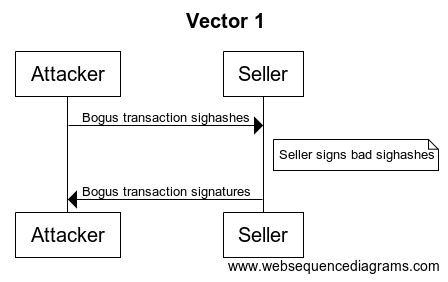
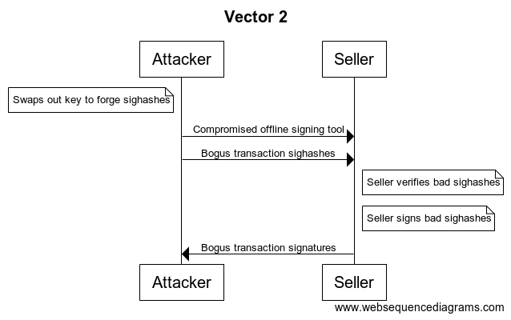
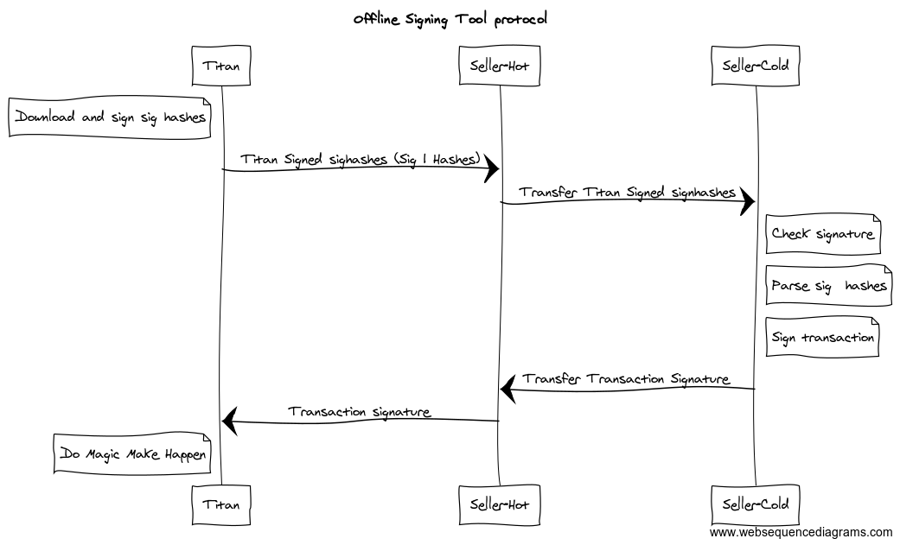

# Offline Signing Tool
            xxxxxxx                 mmmmmmmmmmmm               
           xxx   xxx               mmm        mmm              
      xxxxxxx     xxxxxxx         mm            mm             
      xx   xxx   xxx   xx         mm            mm             
     xx     xxxxxxx     xx       mm              mm            
      xx   xxxxxxxxx   xx        mm              mm            
       xxxxx xxxxx xxxxx         mm              mm            
             xxxxx               mm              mm            
             xxxxx              UUUUUUUUUUUUUUUUUUUU           
             xxxxx              UUUUUUUUUUUUUUUUUUUU           
             xxxxx              UUUUUUUUU   UUUUUUUU           
             xxxxx              UUUUUUUU     UUUUUUU           
             xxxxx              UUUUUUUUU   UUUUUUUU           
             xxxxx               UUUUUUUI   IUUUUUU            
             xxxxx               UUUUUUUI   IUUUUUU            
          xxxxxxxx                UUUUUUUuuuUUUUUU             
          xxxxxxxx                 UUUUUUUUUUUUUU              
             xxxxx                                             
          xxxxxxxx          
          xxxxxxxx                                                       
             xxxxx                                       
## About
This tool lets the user sign bitcoin transactions (sig hashes) without sending private keys.
## Instructions
1. Download the tool via the [releases page](https://github.com/macsj200/tyrion/releases). Be sure to select the binary for your platform.
2. If using a cold signing machine, put the tool on a flash drive. We recommend using an [Ubuntu Live CD/USB](https://tutorials.ubuntu.com/tutorial/try-ubuntu-before-you-install#0) on an airgapped machine.
3. Download the sig hashes file (obtained from [lannister-beta](https://lannister-beta.herokuapp.com/)) and put it on a flash drive.
4. Put your [WIF](https://en.bitcoin.it/wiki/Wallet_import_format) on the flash drive.
5. Launch the tool
2. Input your WIF to the tool
4. Select your sighashes file
4. Press sign
5. Press download
6. Put signatures on flash drive
6. Input signatures to lannister

## Methodology
The offline signing tool is secured using a two-tiered threat model. The first level corresponds to the sighash payload downloaded from lannister, and the second is concerned with the distribution of the offline signing tool itself.

Essentially, there are two attack vectors:
1. An attacker forges sighashes to trick the seller into signing a bogus transaction
2. An attacker forges the offline signing tool and modifies the source code. The attacker then exploits attack vector 1.

We mitigate vector 1 by signing all sighash payloads with our sighash private key. We mitigate vector 2 by signing the source code and distributing securely (WIP).
## Development link
[Link to development version](https://titan-digital-exchange.github.io/offline-signing-tool/)

## Getting started
### Development
1. `yarn install`
2. `yarn start`
3. (optional) `yarn run electron`
## Protocol

## Releasing a new version
Follow [this electron guide](https://electronjs.org/docs/tutorial/application-distribution) to create platform-specific binaries. Upload these binaries to github under a new release.

## Key rotation and storagte
- We have two separate keypairs: the code signing key and the sighashes payload key.
- We should rotate our keys periodically.
### Generate a new public/private key pair
#### Run these commands in terminal
1. `openssl genrsa -out rsa_1024_priv.pem 1024`
2. `openssl rsa -in rsa_1024_priv.pem -out rsa_1024_pub.pem -outform PEM -pubout`